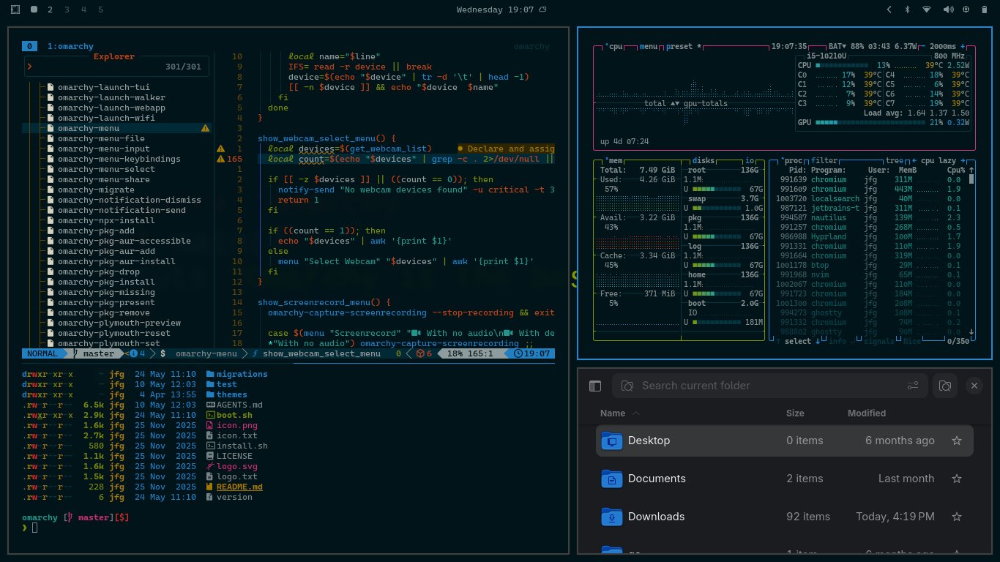
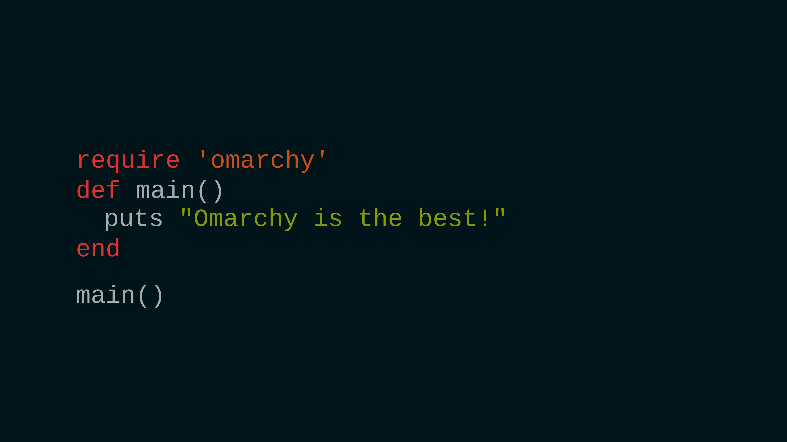
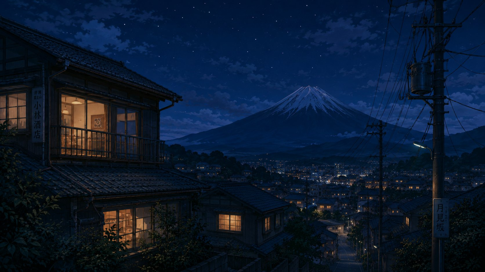

# 🏯 Solarized Osaka

A dark Omarchy theme ported from <a href="https://github.com/craftzdog/solarized-osaka.nvim">solarized-osaka.nvim

## 🎨 About the Theme

**Solarized Osaka** brings the classic [Solarized](https://ethanschoonover.com/solarized/) palette — enriched by craftzdog with extra accent colors for modern UIs — to your entire Omarchy desktop.

---

## 📦 Installation

Install it via terminal:

```bash
omarchy-theme-install https://github.com/joaofelipegalvao/omarchy-solarized-osaka-theme
```

To remove it, use:

```bash
omarchy-theme-remove solarized-osaka
```

---

## 🔄 Usage

Once installed, switch to it like any other Omarchy theme:

```bash
omarchy-theme-set solarized-osaka
```

Or select it visually via **Style → Theme** in the Omarchy menu (`Super + Alt + Space`).

---

## 👀 Preview

### Desktop

  

### Backgrounds

<table>
  <tr>
    <td align="center">
      
      <br>
      <strong>Solarized Code</strong>
    </td>
    <td align="center">
      
      <br>
      <strong>Blue Hour Village</strong>
    </td>
    <td align="center">
      
      <br>
      <strong>Omarchy</strong>
    </td>
  </tr>
</table>

---

## 🙏 Acknowledgments

- **[DHH](https://github.com/DHH)** - For creating Omarchy
- **[craftzdog](https://github.com/craftzdog)** - For the original [solarized-osaka.nvim](https://github.com/craftzdog/solarized-osaka.nvim) colorscheme

---

## 📝 License

This project maintains the same license as the original solarized-osaka.nvim theme.

<p align="center">
  <sub>Made with ☕ for the Omarchy community</sub>
</p>
